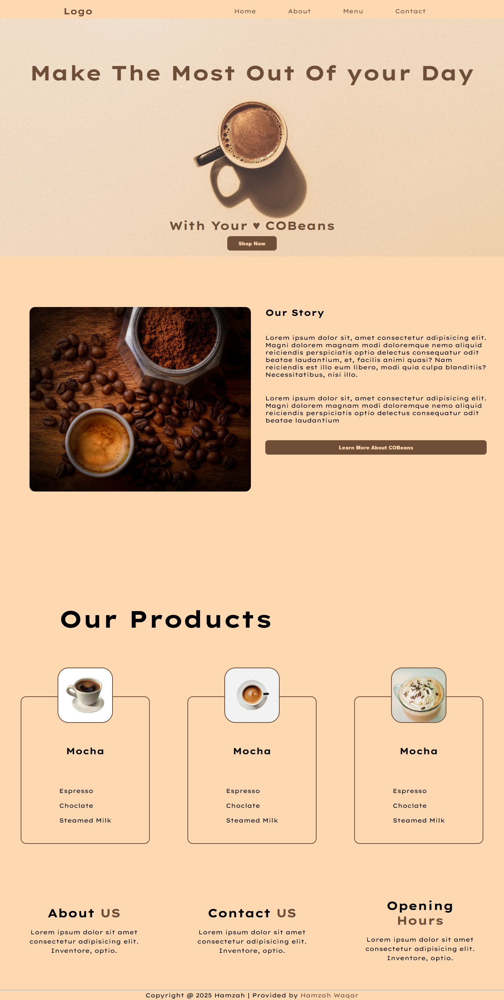

# ☕ COBeans - Make The Most Out Of Your Day

Welcome to **COBeans**, a beautifully designed coffee-themed landing page created with a focus on simplicity, warmth, and user engagement. This responsive webpage is perfect for showcasing a coffee brand, café, or eCommerce coffee shop.

## 🚀 Live Demo

Check out the live version here: [COBeans on GitHub Pages](https://hamzawaqar82.github.io/COBeans/)

---

## 📄 Project Description

**COBeans** is a static landing page designed to:
- Promote a coffee brand with visually appealing product presentation.
- Provide key business details like story, products, and contact info.
- Maintain clean, elegant, and responsive design using modern HTML/CSS practices.

---

## 🔧 Technologies Used

- **HTML5** – Semantic, structured content
- **CSS3** – Custom styling with smooth layout and responsive design
- **FontAwesome / Google Fonts** – For iconography and typography (if applicable)
- **GitHub Pages** – Hosting and deployment

---

## 📸 Features

- 🍫 Hero Section with a warm message and CTA
- 📚 Story Section with image and description
- 🛍️ Products Display – visually consistent product cards
- 📞 Footer with About, Contact, and Opening Hours
- 📱 Fully responsive on desktop and mobile devices

